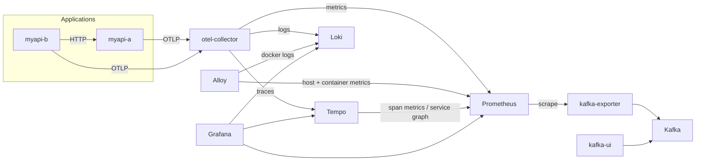

# homelab-infra

Docker Compose stack for a single home-lab server (10 physical cores, 32 GiB RAM, 1 TB disk, no GPU):
a full **LGTM observability stack** (Loki, Grafana, Tempo, Prometheus) fed by **OpenTelemetry** and **Grafana Alloy**, plus **Kafka**, **PostgreSQL**, **MongoDB** and two demo APIs wired end-to-end.

## Architecture



| Signal | Path |
|--------|------|
| App traces / metrics / logs | app → `otel-collector` (OTLP) → Tempo / Prometheus / Loki |
| Host metrics (CPU, RAM, disk, net) | Alloy `prometheus.exporter.unix` → Prometheus remote-write |
| Container metrics | Alloy embedded cAdvisor → Prometheus |
| Container stdout logs | Alloy `loki.source.docker` → Loki (apps labelled `homelab.logs.otlp=true` are skipped to avoid duplicates) |
| Kafka lag / throughput | `kafka-exporter` ← Prometheus scrape |
| Service graph, RED metrics | Tempo metrics-generator → Prometheus |

Grafana is provisioned with the three datasources already cross-linked (logs ↔ traces ↔ metrics via `trace_id` and exemplars) and a **Homelab Overview** dashboard set as home page.

## Requirements

- Linux host with Docker Engine and **Docker Compose ≥ 2.20** (uses `include`)
- BuildKit (default in recent Docker) for the Dockerfile heredocs

## Quick start

```bash
cp .env.example .env
$EDITOR .env                 # replace every "changeme", set KAFKA_EXTERNAL_HOST to the server's LAN IP
./scripts/validate.sh        # env + compose + prometheus/loki/otel/alloy config checks
./scripts/up.sh
```

Then open Grafana on `http://<server>:3000` and generate traffic:

```bash
for i in $(seq 1 200); do curl -s "http://localhost:8002/chain?fanout=5" >/dev/null; done
```

## Makefile

Everything is also available through `make` (run `make` to list targets):

```bash
make env && make validate && make up       # first start
make ps / make health / make stats         # status, HTTP checks, CPU/RAM
make logs S=kafka                          # follow one service (TAIL=500 for more history)
make restart S="grafana tempo"
make recreate S=otel-collector             # after editing a config file
make up-obs / up-kafka / up-db / up-apps   # start one group only
make sh S=kafka / make psql / make mongosh
make topics / topic-create TOPIC=demo / consume TOPIC=demo / groups
make reload-prometheus / reload-alloy      # hot reload, no restart
make traffic N=500 FANOUT=5                # demo traces
make backup                                # Postgres + Mongo into ./backups
make restore-postgres FILE=backups/x.dump
make update                                # pull new images, then up
make clean                                 # DELETES all data, asks you to confirm
```

## Scripts

| Script | Purpose |
|--------|---------|
| `scripts/up.sh [svc...]` | build and start everything (or selected services) |
| `scripts/down.sh [--volumes]` | stop; `--volumes` deletes all data after confirmation |
| `scripts/logs.sh [svc...]` | follow logs (`TAIL=500` to change history) |
| `scripts/validate.sh` | pre-flight checks |
| `scripts/_common.sh` | shared helpers (loads and exports `.env`) |

You can also use plain `docker compose` from the repo root; the scripts just add safety checks.

## Ports

All ports bind to `BIND_ADDR` (`0.0.0.0` = LAN, `127.0.0.1` = local only).

| Service | Port | Notes |
|---------|------|-------|
| Grafana | 3000 | admin credentials from `.env` |
| Prometheus | 9090 | |
| Loki | 3100 | API only |
| Tempo | 3200 | query API only |
| OTel Collector | 4317 / 4318 / 13133 | OTLP gRPC / HTTP / health |
| Alloy | 12345 | pipeline UI |
| Kafka | 9094 | external listener; containers use `kafka:9092` |
| Kafka UI | 8080 | **no auth** |
| kafka-exporter | 9308 | `/metrics` |
| PostgreSQL | 5432 | |
| MongoDB | 27017 | |
| myapi-a / myapi-b | 8001 / 8002 | `/docs` |

## Resource budget

Memory limits are sized to leave ~10 GiB to the OS page cache (which Kafka, Postgres and Loki all rely on). CPU limits are caps, not reservations.

| Service | Memory limit | CPU cap |
|---------|-------------:|--------:|
| PostgreSQL | 4 GiB | 2 |
| Prometheus | 3 GiB | 2 |
| Loki | 3 GiB | 2 |
| Tempo | 3 GiB | 2 |
| MongoDB | 3 GiB | 2 |
| Kafka | 2 GiB (1 GiB heap) | 2 |
| Kafka UI, Grafana, Alloy | 768 MiB each | 1 |
| OTel Collector, each API | 512 MiB each | 1 |
| kafka-exporter | 128 MiB | 0.5 |
| **Total** | **~22 GiB** | |

## Retention (disk)

| Store | Retention | Where to change |
|-------|-----------|-----------------|
| Prometheus | 30 d or 50 GB | `.env` `PROMETHEUS_RETENTION_*` |
| Loki | 30 d | `loki/config.yml` `retention_period` |
| Tempo | 7 d | `tempo/config.yml` `block_retention` |
| Kafka | 7 d, 10 GiB/partition | `kafka/compose.yml` |

Data lives in named Docker volumes (`docker volume ls | grep homelab`).

## Instrumenting your own service

Any service on the stack just needs:

```yaml
environment:
  OTEL_SERVICE_NAME: my-service
  OTEL_EXPORTER_OTLP_ENDPOINT: http://otel-collector:4318
  OTEL_EXPORTER_OTLP_PROTOCOL: http/protobuf
labels:
  homelab.logs.otlp: "true"   # only if it ships logs via OTLP
```

Add its folder with a `compose.yml` and list it under `include:` in the root `compose.yml`. From outside Docker, point OTLP at `<server>:4318`.

## Security notes

This is a trusted-LAN setup: Kafka, Kafka UI, Loki, Tempo and Prometheus have no authentication. Before exposing anything beyond the LAN, set `BIND_ADDR=127.0.0.1` and put a reverse proxy with TLS + auth (Traefik, Caddy) in front. Alloy runs `privileged` with the Docker socket mounted (required for cAdvisor and log discovery).

## Upgrading

Image tags are pinned in `.env`. Bump one at a time, run `./scripts/validate.sh`, then `./scripts/up.sh <service>`. Read release notes for Tempo, Loki and the OTel Collector in particular: their config formats change between minor versions.
